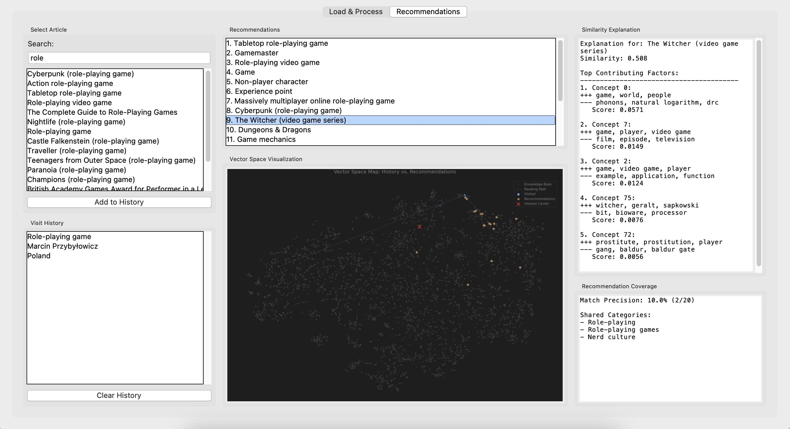

# wiki-recommend

End-to-end information-retrieval pipeline for Wikipedia — crawl, vectorize, recommend, visualize — wrapped in a Tkinter GUI. Information Retrieval course project.

---



> **[Example Log](docs/example_log.txt)**

---

## What it does

1. **Crawl** — starting from a seed Wikipedia article, BFS outward via internal links. Multi-threaded (6 workers), deduplicated, configurable link-per-page and total-article limits.
2. **Preprocess** — tokenize, lemmatize, and strip stopwords with NLTK.
3. **Vectorize** — TF-IDF, optionally reduced via LSA (`TruncatedSVD`). Configurable n-grams.
4. **Recommend** — cosine similarity against a user's browsing history, history-weighted so recent reads count more.
5. **Visualize** — t-SNE 2D projections of the article space, plus interactive network graphs of article relationships (Plotly). Also produces Zipf's Law / Heaps' Law plots and term-distribution summaries.

## Run

```bash
python App.py
```

The GUI opens with two tabs:

- **Load & Process** — scrape a fresh corpus or load a cached one; pick seed article, links/page, crawl limit.
- **Recommendations** — vectorize, browse, and get recommendations based on history; view t-SNE and network graphs.

## Cached corpora

Pre-scraped datasets ship with the repo for: _Cyberpunk 2077_, _The Witcher_, _Formula One_, _Gojira_, _Poland_, _Ukraine_.

## Dependencies

`requests`, `beautifulsoup4`, `pandas`, `numpy`, `scikit-learn`, `nltk`, `networkx`, `plotly`, `matplotlib`, `pillow`. GUI via stdlib `tkinter`.
